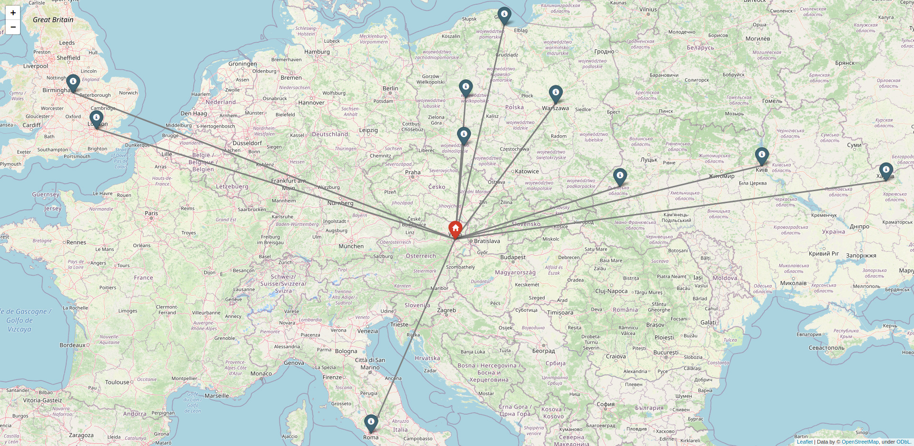

# Films map
***Films_map*** is a program for generating the nearest location of films,depending on user`s location and year inputted by user

## Main files
- **main.py** -- main module of program
- **location.list** -- films database

## How it works?
When program runs first time, user will be asked to enter year of films, he wants to get and his current location.
```
Please enter a year you would like to have a map for: 2012
Please enter your location (format: lat, long):48.21236439397459, 16.371810554823952
```
After that user see such a message and he should wait until map generates.
```
Map is generating...
Please wait...
```

### Result
Result of running this file is a HTML-file which represents map with user`s location point and film points closest to user.

